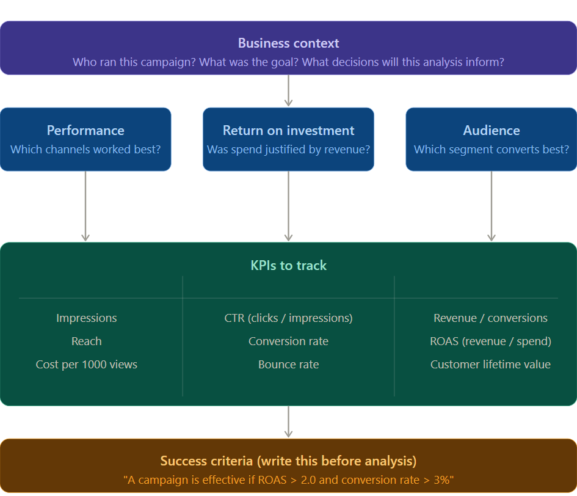
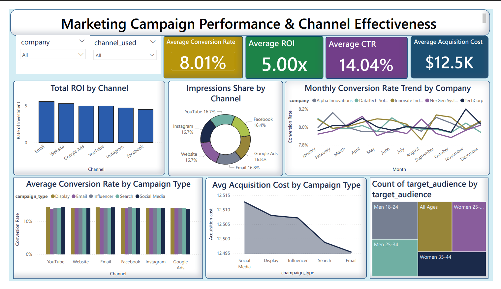

# 📊 Marketing Campaign Performance & Channel Effectiveness Analysis

An end-to-end data analytics project analyzing multi-channel marketing campaign performance using Python and Power BI to identify ROI contribution patterns, conversion trends, and audience engagement insights.

---

## 📌 Project Overview

Marketing teams invest across multiple channels such as Email, Social Media, Paid Ads, and SEO to improve engagement and conversions. However, identifying which campaigns generate the highest return and which audience segments respond best is essential for optimizing marketing strategy and budget allocation.

This project analyzes marketing campaign performance using a KPI-driven approach to identify high-impact channels, evaluate campaign effectiveness, and uncover high-converting customer segments to support data-driven marketing decisions.

---

## ❓ Business Questions

This analysis answers the following key questions:

1. Which marketing channel delivers the highest ROI?
2. How does conversion rate vary across campaign types?
3. Which audience segment shows the highest engagement?
4. What is the acquisition cost across campaign strategies?
5. How has conversion rate changed over time across companies?

---

## 📈 Analytical Framework

The analysis follows a structured KPI-driven framework linking business questions with measurable marketing performance indicators.

---

## 📊 Key Performance Indicators (KPIs)

| KPI | Formula | Purpose |
|-----|---------|---------|
| CTR | Clicks / Impressions | Measures engagement efficiency |
| Conversion Rate | Conversions / Clicks | Measures campaign effectiveness |
| ROI | (Revenue − Cost) / Cost | Measures campaign profitability |
| CAC | Cost / Conversions | Measures acquisition efficiency |
| Impressions | Total views | Measures campaign reach |

---

## 🎯 Success Criteria

The analysis is considered successful if:

- High-performing channels are identified using ROI and conversion rate
- Campaign-type effectiveness differences are detected
- Audience segmentation insights are extracted
- Conversion trends across companies are evaluated
- Actionable marketing optimization recommendations are generated

---

## 🗂️ Dataset Description

The dataset includes campaign-level performance metrics across companies, marketing channels, audience segments, and campaign strategies.

Key variables:

| Column | Description |
|--------|-------------|
| campaign_id | Unique campaign identifier |
| company | Campaign owner organization |
| campaign_type | Campaign strategy type |
| target_audience | Audience demographic group |
| channel_used | Marketing channel |
| conversion_rate | Conversion performance metric |
| acquisition_cost | Customer acquisition cost |
| roi | Return on investment multiplier |
| clicks | Total campaign clicks |
| impressions | Total campaign impressions |
| engagement_score | Engagement intensity metric |
| customer_segment | Customer persona group |
| date | Campaign execution date |

---

## 🔍 Project Workflow

The project follows a structured analytics workflow:

### Phase 1 — Problem Framing
Defined business questions and KPI success criteria before analysis.

### Phase 2 — Data Cleaning (Python)
- Checked missing values and duplicates
- Standardized column names
- Corrected data types
- Prepared dataset for analysis

Script available here: 
scripts/data_cleaning.py

### Phase 3 — Exploratory Data Analysis (Python)
Performed dataset exploration to identify performance patterns across:
- channels
- campaign types
- audience segments
- companies
- time trends

Notebook available here:
notebooks/eda_analysis.ipynb

### Phase 4 — Dashboard Development (Power BI)

Built an interactive analytics dashboard containing:

- KPI summary cards
- ROI contribution by channel
- Channel impressions distribution
- Monthly conversion rate trends
- Conversion rate comparison by campaign type
- Acquisition cost comparison
- Audience segmentation treemap
- Interactive slicers for filtering

Dashboard file:
dashboard/marketing_dashboard.pbix

---

## 📊 Dashboard Preview

The dashboard enables interactive filtering by company, channel, campaign type, and audience segment to support campaign performance comparison.

---

## 💡 Key Insights

1. Email campaigns generated the highest ROI with relatively lower acquisition cost compared to other channels.

2. Conversion rates remained consistent across companies, indicating stable campaign execution performance.

3. Budget exposure across channels appeared evenly distributed, suggesting opportunities for performance-based allocation optimization.

4. Social Media campaigns showed comparatively higher acquisition costs than other campaign types.

5. Younger audience segments received the highest campaign focus, indicating demographic targeting concentration.

---

## ✅ Recommendations

Based on the analysis:

**Increase investment in high-ROI channels**
Reallocate budget toward Email and high-performing digital channels.

**Adopt performance-weighted budget allocation**
Move from equal distribution toward ROI-driven allocation strategy.

**Expand targeting toward underrepresented segments**
Develop campaigns tailored for additional demographic groups.

**Optimize higher-cost campaign strategies**
Review Social Media campaign targeting efficiency.

---

## 🛠️ Tools & Technologies Used

| Tool | Purpose |
|------|---------|
| Python (Pandas) | Data cleaning & preprocessing |
| Matplotlib / Seaborn | Exploratory visualization |
| Jupyter Notebook | Analysis workflow |
| Power BI | Dashboard development |
| DAX | KPI calculations |
| GitHub | Version control & portfolio hosting |

---

## 🔗 Quick Links

| Resource | Location |
|----------|----------|
| Power BI Dashboard | `dashboard/marketing_dashboard.pbix` |
| Dataset | Available via Google drive (link below) |
| EDA Notebook | `notebooks/eda_analysis.ipynb` |
| Data Cleaning Script | `scripts/data_cleaning.py` |

## 📁 Dataset Access

The dataset used in this project exceeds GitHub’s file size limit (100 MB).  
It can be downloaded here:

https://drive.google.com/drive/folders/1NzGhKJtBAPwroyMJbrRdPCcGxk-hY8Ie?usp=sharing

---

## ▶️ How to Run This Project

Clone the repository:
git clone https://github.com/yourusername/marketing-campaign-effectiveness-analysis.git

Install dependencies:
pip install pandas matplotlib seaborn jupyter

Run notebook:
jupyter notebook notebooks/eda_analysis.ipynb

Open dashboard:
dashboard/marketing_dashboard.pbix

---

## 👤 Author

Ramya Sree SV
LinkedIn:
www.linkedin.com/in/ramyasreesv
GitHub:
https://github.com/ramya63822

